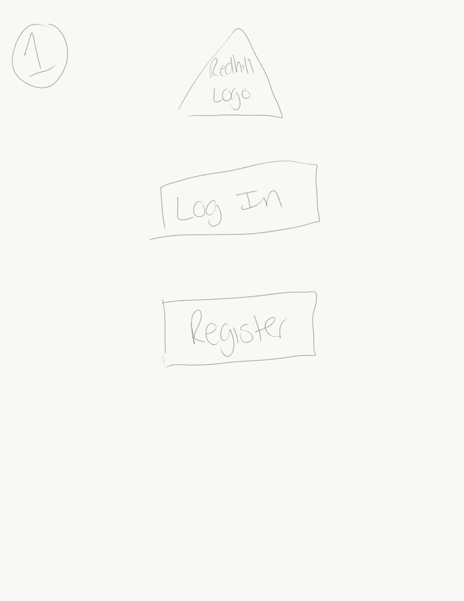
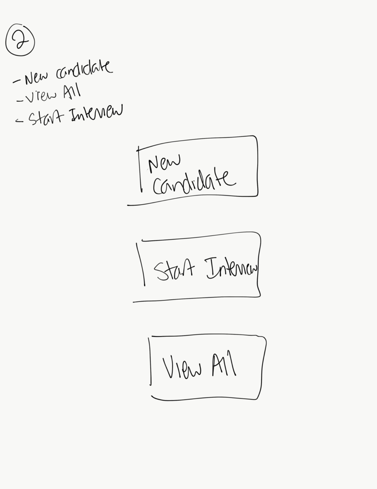
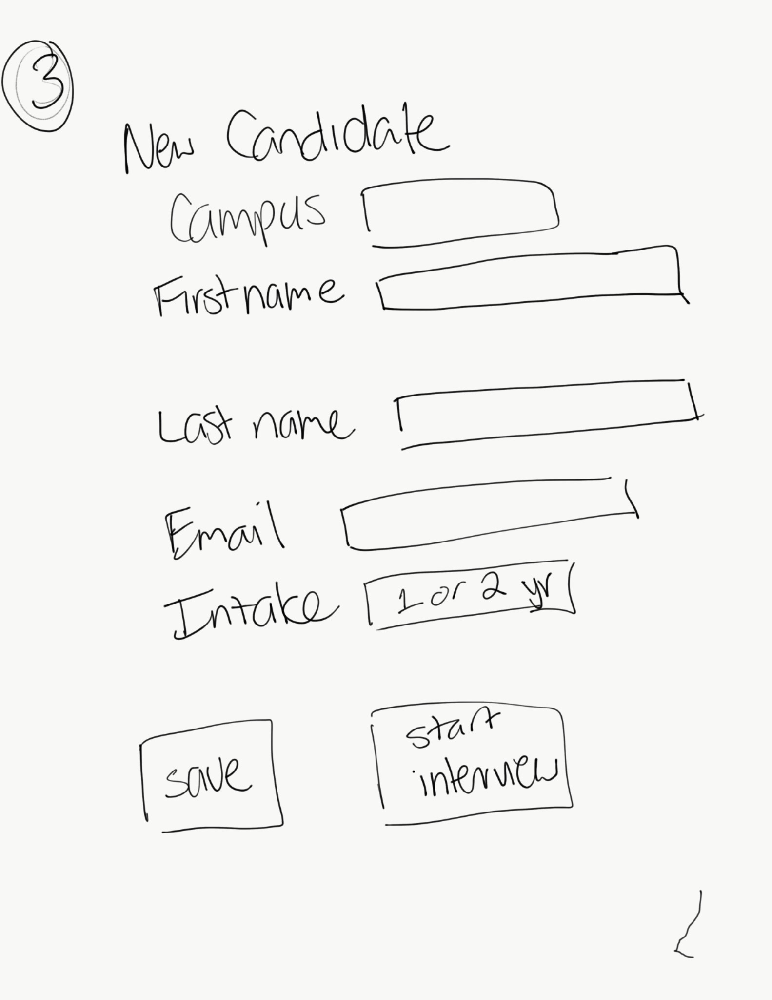
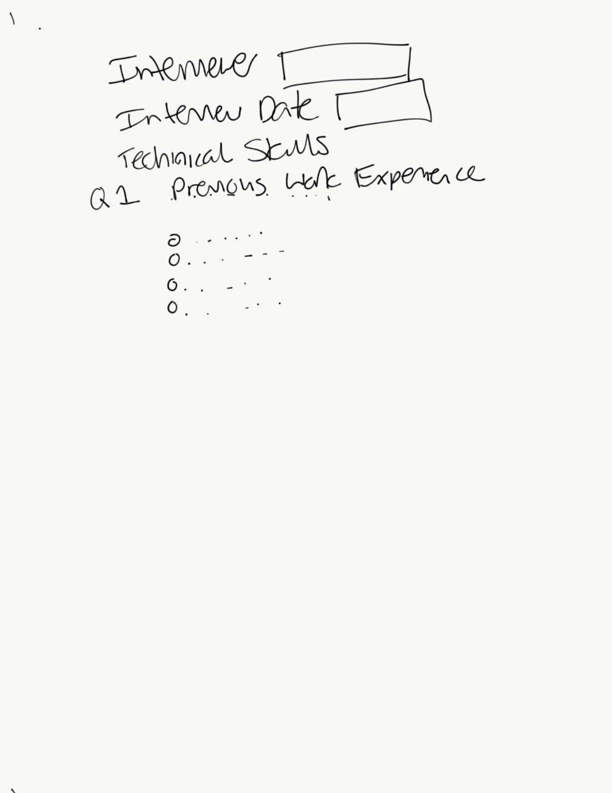
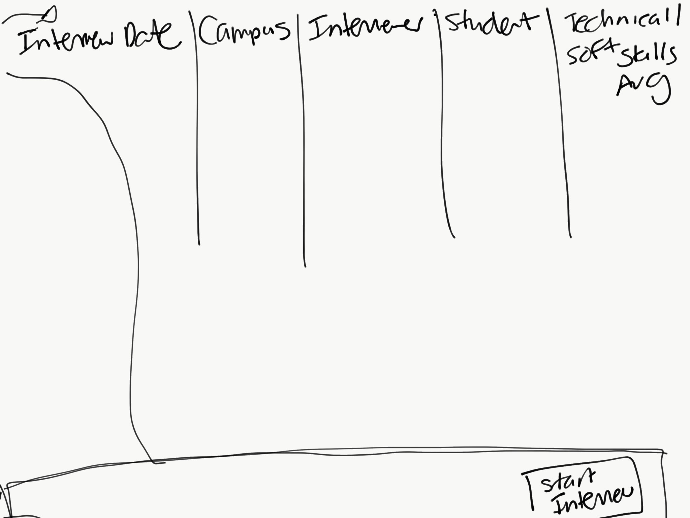
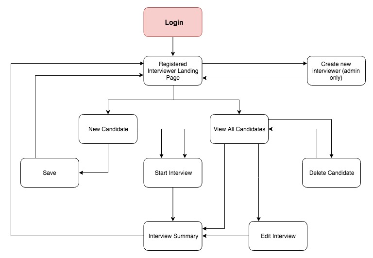
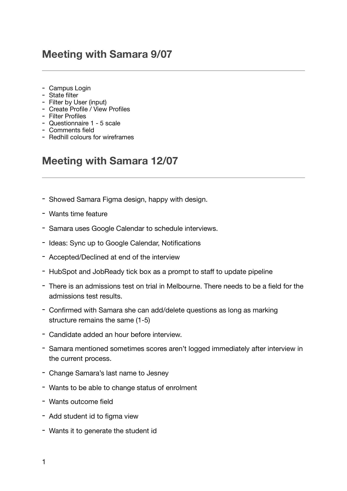
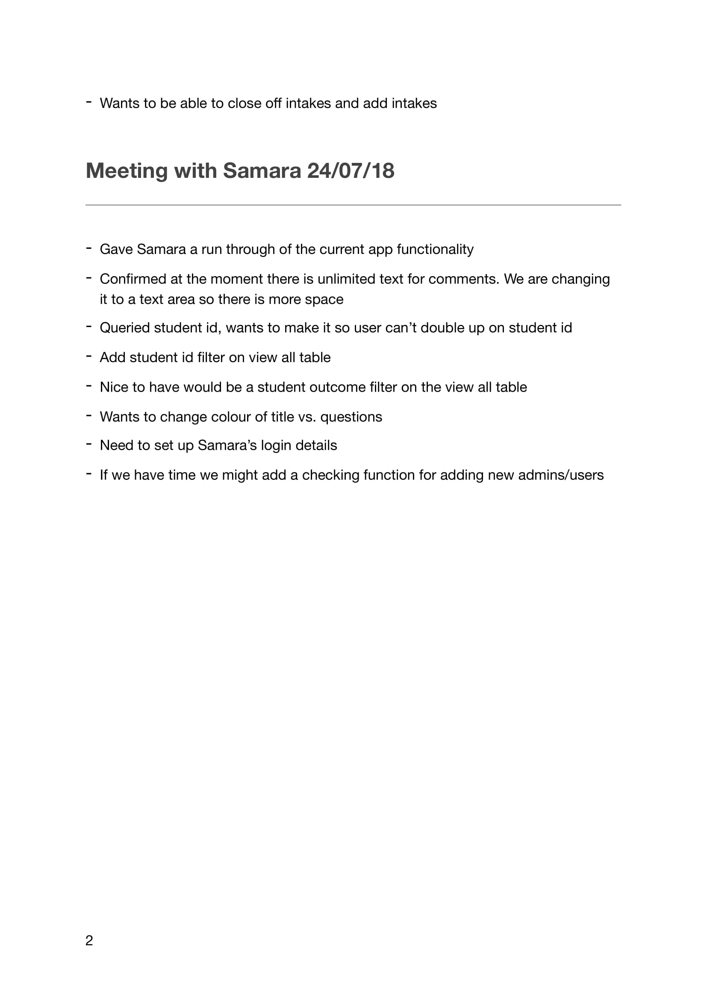
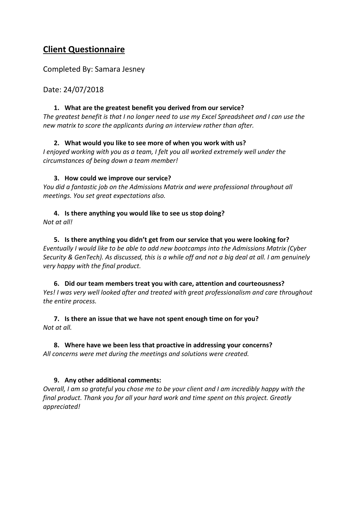
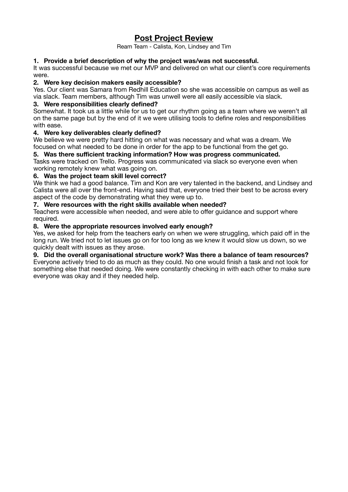

# Front-end 
https://ream.now.sh/  
https://github.com/timmoon7/ream-front
# Back-end 
https://github.com/timmoon7/ream  
http://ream-api.now.sh/users  
http://ream-api.now.sh/questions  
http://ream-api.now.sh/interviews
# Term 3 Project - REAM
- [Part A](#a)
- [Part B](#b)
- [Part C](#c)

#  Part A

## Table of Contents:
- [Q1 Who is your client?](#1)
- [Q2 What is your client’s need? ](#2)
- [Q3 Describe the client’s current setup and data.](#3)
- [Q4 Describe the project will you be conducting and how your App will address the
client’s needs.](#4)
- [Q5 Identify and describe the software (including databases) to be used in your App.
](#5)
- [Q6 Identify and describe the network setup you will use in your development.
](#6)
- [Q7 Identify and describe the infrastructure (i.e. hardware) that your App will run on.
](#7)
- [Q8 Describe the architecture of your App.](#8)
- [Q9 Explain the different high-level components (abstractions) in your App.](#9)
- [Q10 Detail any third party services that your App will use.](#10)
- [Q11 Identify the database to be used in your app and provide a justification for your choice.
](#11)
- [Q12 Discuss the database relations to be implemented.](#12)
- [Q13 Provide your database schema design.](#13)
- [Q14 Provide User stories for your App.](#14)
- [Q15 Provide Wireframes for your App.](#15)
- [Q16 Describe the way Tasks are being allocated and tracked in your project.](#16)
- [Q17 Discuss how Agile methodology is being implemented in your App.](#17)
- [Q18 Provide an overview and description of your Source control process.
](#18)
- [Q19 Provide an overview and description of your Testing process.](#19)
- [Q20 Discuss and analyse requirements related to information system security](#20)
- [Q21 Discuss methods you will use to protect information and data.](#21)
- [Q22 Research what your legal obligations are in relation to handling user data.](#22)
#### 1.  Who is your client?
Our client is Coder Academy’s Operations and Client Services Team. Our direct contact is Samara Jesney.

#### 2.   What is your client’s need (i.e. challenge) that you will be addressing in your project?  
The clients challenge is that the system they use to track, record and analyse student admissions interviews is a Google sheet, which is used by the Melbourne, Sydney and Brisbane campuses. 
We will be addressing this by creating an application allowing the interviewer to be able to log responses in real time and make decisions based on the profiles created. Instead of the interviewer interviewing prospective students and then going back to a Google sheet to input responses.  

Some other challenges that Coder Academy has with the current process are: 
- Coder Academy wants to make sure they are accepting students that will be successful in the course. 
- Interviewer must remember interviewee responses and be able to input at a later time. 
- Time is spent writing notes during the interview, and then need to re-entered into the Google sheet. 
- Multiple users using the Google sheet at the same time results in sheet errors and data loss. 
- The current system also makes it difficult to track trends.

#### 3.  Describe the client’s current setup and data.  
Currently Coder Academy uses a Google sheet which is utilised across all three campuses, Melbourne, Brisbane and Sydney. The Google sheet contains the questions asked during the admissions interview. Answers are manually entered after the interview is complete.

#### 4.  Describe the project will you be conducting and how your App will address the client’s needs.  
We will be creating an interface where Coder Academy staff conducting admissions interviewers can, in real time log interview responses from candidates for reflection at a later time. This app will address the clients needs by saving time with live responses and ratings and resolving the current issues surrounding using a static Google sheet. The main goal of our app is to assist Coder Academy in selecting the best candidates for the course based on real, applicable data and reducing data errors. 

#### 5.  Identify and describe the software (including databases) to be used in your App.  
#### Front-End:
React   
Reason: It uses JSX which is familiar HTML syntax converted into Javascript. It’s simplicity makes it easy to learn, it’s native approach means that we can use it on different tech interfaces and it’s testability is also appealing.  

#### Back-end:
Node & Express 
Reason: It’s lightweight, and simple to set up a server in just a few lines of code. It also helps organise our web application with models, views and controllers.  

#### Database:
MongoDB & Mongoose   
Reason: It’s data representation is in JSON. It’s high performance, dynamic and flexible with how we can store our data It’s also built for the cloud allowing for scaling and agility. 

#### 6.  Identify and describe the network setup you will use in your development. 
Our React front-end will interact with our Express backend which in turn communicates with MongoDB via Mongoose. Data will be served via cloud architecture on the internet. 

#### 7.  Identify and describe the infrastructure (i.e. hardware) that your App will run on.  
Our client has requested that the application runs on an iPad interface (iOS) as this will be the easiest to use when conducting interviews. They would also like the application to be reflected on the web browser. We plan to deploy the backend of the application on Now and the frontend on Netlify.

#### 8.  Describe the architecture of your App.   
In the backend we have a server comprised of Node and Express. Our data will be stored on MongoDB Atlas, with Mongoose as a connector. We have a models, controllers and routes folder structure in the backend. In the front end we have our page components and assets (images/css). The frontend will be hosted on Netlify. The backend will be hosted on Now.

#### 9.  Explain the different high-level components (abstractions) in your App.
The high level components are Users, Interviews and Questions. These will be the building block components used for the frontend and backend. 

Users will be staff members who will have access to the application and will be conducting admissions interviews.

Interviews with include the details of the candidate being interviewed.

Questions are the actual questions being asked during the interview.

#### 10.  Detail any third party services that your App will use.
- MongoDB Atlas for hosting the database in the cloud.
- Now will be used for deployment of our backend application.
- Netlify will be used for deployment of our frontend application.

#### 11.  Identify the database to be used in your app and provide a justification for your choice.  
The database to be used is MongoDB. The reason for our choice is it’s data representation is in JSON. It’s high performance, dynamic and flexible with how we can store our data, and it’s also built for the cloud, for scaling and agility (rapid development).

#### 12.  Discuss the database relations to be implemented.
We have 3 basic collections: Users, Questions and Interviews. Users and questions will be embedded in the interviews collection. 

#### 13.  Provide your database schema design.

#### 14.  Provide User stories for your App.
- As an interviewer I want to be able to record answers in real time so that I can record accurate information.
- As an interviewer I want a streamlined process so that my time is best used interacting with the candidate.
- As an interviewer I want to be able to easily rate the candidates responses to questions so that I can continue on with the interview and maintain my focus on the conversation.
- As an interviewer I want to be able to easily read the questions to the candidate so that they can understand me and the conversation can flow naturally.
- As an interviewer I want to be able to easily add in interviewee information prior to the interview so that I can save time.
- As an administrator I want to be able to review candidate data easily so that I can make good decisions.
- As an administrator I want to be able to easily see which staff member conducted which interview so that I can track results.
- As an administrator I want easily be able to see interviews conducted at each campus so that I can track potential numbers.
- As an administrator I want to be able to easily see which candidates I still require interviews so that I can plan my work more efficiently.
- As an administrator I want to be able to alter questions so that I can get better responses from candidates.
- As an educator I want students that are capable of completing the course so that they are successful.
- As an educator I want to teach students that are eager to learn so that they can be successful.
- As Coder Academy we want to have the most appropriate candidates selected so that employable at the end of the course.
- As Coder Academy we want multiple users (interviews and administrators) to be logged in at the same time so that work can be completed simultaneously.
- As Coder Academy we want our staff members conducting interviews to be able to do so as quickly and easily and possible so that our staff can be as efficient in roles as possible.

#### 15.  Provide Wireframes for your App.  
https://www.figma.com/file/Mk5ccSdSuA67OOHbsYK9XoyJ/Project-3

#### 16.  Describe the way Tasks are being allocated and tracked in your project.  
Tasks are being allocated and tracked via Trello. Tasks are made small and achievable, and are colour coded based on progress. There is a further layer of task separation with colour coding based on what is part A, B and C. 

#### 17.  Discuss how Agile methodology is being implemented in your App.  
Agile development in our app at it’s core comes from our team Trello board. Incremental work is allocated to all team members instead of all at once. 

We plan to continously reassess tasks and how they are allocated and then alter things as required.

#### 18.  Provide an overview and description of your Source control process.  
We will use git and Github as our repository to handle our source control process. We will have a Github master Tim, and loyal subservients Kon,Calista and Lindsey.  
Each feature will have it’s own branch, and once the branch is approved by all team members it will be merged into the master branch. 

#### 19.  Provide an overview and description of your Testing process.  
- We will all test our own code and the ask a team member to do a code review.
- We will use Postman to test our ie. GET and POST methods in the backend.
- Each component will be tested individually to ensure they work before deployment
- Jest will also be used for Javascript testing

#### 20.  Discuss and analyse requirements related to information system security.  
This app is available for interviewers and administrators at Coder Academy. The guidelines are that only authenticated interviewers are able to input information and read candidate profiles. Authenticated administrators are able to read candidate profiles and alter questions. Questions can only be altered by administrators who have been authorised. 

The specific guidelines we received from our client in relation to their privacy policy are outlined below in question 22.

#### 21.  Discuss methods you will use to protect information and data.  
- Authentication/Authorisation (tokens)  
So that only users that are authorised can access and use the application.

- SSL certificate & HTTPS hosted  
To make sure the website is secure.

- Only hashed passwords are stored in the database  
If by chance someone views or is able to access the database they will not have access to passwords and they will remain secure.

#### 22.  Research what your legal obligations are in relation to handling user data.  
We researched and reviewed the Australian Privacy Principles, and these were the main points:
- Have a privacy policy in place.
- Let users know how their information is being used, especially if it is going to be handled by a third party.
- Put technical security measures in place such as a SSL certificate. 
- Data is viewed on a need to know basis.
- Give users access to their data upon request, and must be authorised. 
- Users have the right to access and correct their information. 
- Ensure that data is accurate, complete and up to date. 
- You can only collect personal information if it’s necessary for the function or activity of your business. 
- Personal information must not be disclosed for direct marketing purposes.
- Follow Australian privacy principles. https://www.oaic.gov.au/privacy-law/privacy-act/australian-privacy-principles

The compliance officer at RedHill Education provided us with the following information regarding their data Privacy Policy:  
- They are required to comply with the Privacy Act and the Data Breach Notification (amendment) Act. These are the 2 key pieces of legislation that we need to consider when managing data.
- In addition to this we are also required to comply with related legislation in any country or territory in which we are actively sourcing data from. An example of the is the GDPR designed to protect EU citizens.
- Our Privacy Policy describes how AIT and its subsidiary brand Coder Academy we complies and what rights individuals have https://res.cloudinary.com/ait-website/image/upload/v1526966656/pdf/FINAL_Privacy_and_Data_Collection_Policy_V1.0_26042018_1.pdf
- The RedHill site has a separate privacy Policy that relates to its obligations which are different to the legal obligations of the various education providers owned by RedHill.

#  Part B
## Table of Contents:
- [Problem](#23)
- [Solution](#24)
- [Summary and Project Charter](#25)
- [Design](#26)
- [User Stories](#27)
- [Workflow Diagram](#28)
- [Database Design](#29)
- [Project Plan & Estimation](#30)
- [Communication with Client and Meeting Minutes](#31)
- [Client Questionnaire](#32)
- [Post Project Review](#33)

###  Problem
As discussed in part A our client is Coder Academy's and more broadly RedHill Education's Operations and Client Services Team. 

When a prospective candidate applies for a course, the Operations and Client Services Team conducts an admissions interview where they ask the prospective candidate a set of questions. The candidate is then scored on their answers and their suitability for the course is assessed based on an admissions matrix. 

The clients challenge is that their current admissions matrix utilises an across campus google sheet to analyse student responses in their admissions interview. This static sheet is useful, not sufficient in it’s usability. Some of the issues with the current admissions system are the following. 
- Coder Academy is seeking students that will be successful in the course, so the information they retrieve must be accurate and have the accessibility to be analysed. 
- The interviewer must remember interviewee responses from the interview and be able to to record them at a later time.
- Notes are made during the interview, then are required to be re-entered following into the Google sheet. 
- Multiple users using the Google sheet at the same time result in sheet errors and data loss.

###  Solution 
We have created an application that allows the Operations and Client Services Team who are conducting admission interviews to be able to log real time interview responses from candidates for reflection at a later time. 

This app will address the clients needs by saving time with live responses and ratings, resolving issues surrounding using a static Google sheet. The main goal of our app is to assist Coder Academy in selecting the best candidates for the course based on real, applicable data, relieving errors.

###  Summary and Project Charter
After multiple discussions with our client, as outlined below in the meeting minutes we received sign off from her to begin the process to build an app that would help to solve her current problems.

The app will be used during the admissions interview on an iPad. The interviewer will log in, and be able to enter new candidate details prior to the start of the interview. When the interview commences, the interviewer will be able to, in real time log responses from the candidate. At the end of the interview, the responses are submitted and an interview summary is displayed.  The answers are scored, and a total is provided to determine whether or not the candidate meets the admissions criteria. The interview data is saved, so the interviewer is able to access the information at a later time. By viewing all, the interviewer can not only view the most recent candidate’s scores, but all other candidates previously interviewed across campuses so the data can be analysed.  

###  Initial Design

### Wireframes
Our wireframes were designed in Figma and can be found here: 
https://www.figma.com/file/Mk5ccSdSuA67OOHbsYK9XoyJ/Project-3

### Wireframes (Before)
Our wireframes before receiving client feedback. 

### Wireframes (After)
Our wireframes after receiving client feedback. We had an meeting with Samara where we showed her the wireframes and discussed how it could be adjusted to better suit her needs. 

###  User Stories
- As an interviewer I want to be able to record answers in real time so that I can record accurate information.
- As an interviewer I want a streamlined process so that my time is best used interacting with the candidate.
- As an interviewer I want to be able to easily rate the candidates responses to questions so that I can continue on with the interview and maintain my focus on the conversation.
- As an interviewer I want to be able to easily read the questions to the candidate so that they can understand me and the conversation can flow naturally.
- As an interviewer I want to be able to easily add in interviewee information prior to the interview so that I can save time.
- As an administrator I want to be able to review candidate data easily so that I can make good decisions.
- As an administrator I want to be able to easily see which staff member conducted which interview so that I can track results.
- As an administrator I want easily be able to see interviews conducted at each campus so that I can track potential numbers.
- As an administrator I want to be able to easily see which candidates I still require interviews so that I can plan my work more efficiently.
- As an administrator I want to be able to alter questions so that I can get better responses from candidates.
- As an educator I want students that are capable of completing the course so that they are successful.
- As an educator I want to teach students that are eager to learn so that they can be successful.
- As Coder Academy we want to have the most appropriate candidates selected so that employable at the end of the course.
- As Coder Academy we want multiple users (interviews and administrators) to be logged in at the same time so that work can be completed simultaneously.
- As Coder Academy we want our staff members conducting interviews to be able to do so as quickly and easily and possible so that our staff can be as efficient in roles as possible.

###  Workflow Diagram
The workflow diagram was built based on the wireframes. This was used as a reference point when building the app.

###  Database Design

###  Project Plan & Estimation
At the beginning of the project we created an estimation for the project which helped to give us a great overview of the milestones that we needed to achieve and helped us to plan out our daily work and a great reference point for tracking our progress.

Agile development in our app at it’s core came from our team Trello board. Incremental work was allocated to all team members instead of all at once. We continously reassess tasks and how they are allocated and then altered things as required. 

Each day as a team we discussed how our tasks were going and then made any changes that were required. We always referred back to our users stories and the communications with our client to make sure the app was as user friendly as possible.

We constantly checked and tested each others code and offered feedback where appropriate. On a number of occasions throughout the process we found it helped to pair program to solve a problem together.

Our final trello board can be found here:

https://trello.com/b/hJPywhKY/ca-term-3-project

One of our biggest challenges with task allocation was that one of our team members was unwell and had to work from home for the final two weeks of the project.

This meant that the majority of our teams communication was via slack. Although this was an added challenge it was a great learning exercise for the team for something that we will no doubt encounter during our careers.

###  Communication with Client and Meeting Minutes
We recorded all of offical meetings that we had with our client as shown below in the meeting minutes. All additional communications and follow up questions were done via Slack as requested by the client.

###  Client Questionnaire

Please note the client questionnaire was filled out prior to submission date due to our client going on annual leave.

###  Post Project Review

#  Part C
The presentation slides have been included in the submitted documents.

During the presentation we will spent the majority of our allocated time showcasing the deployed version of the app and its features.